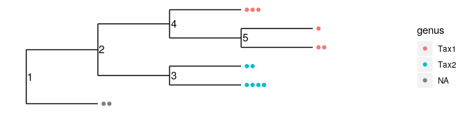
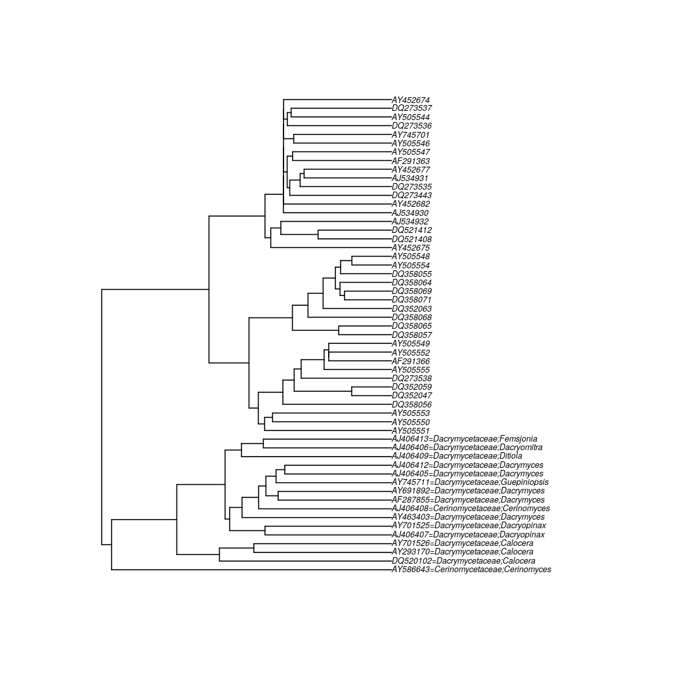
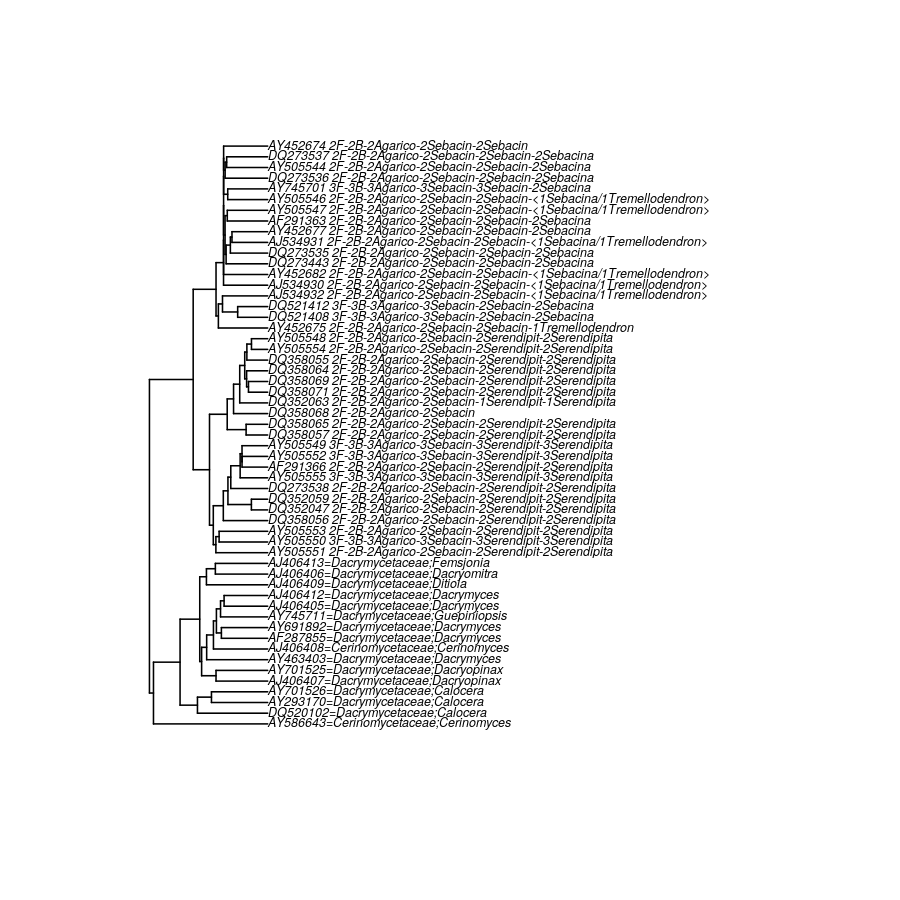
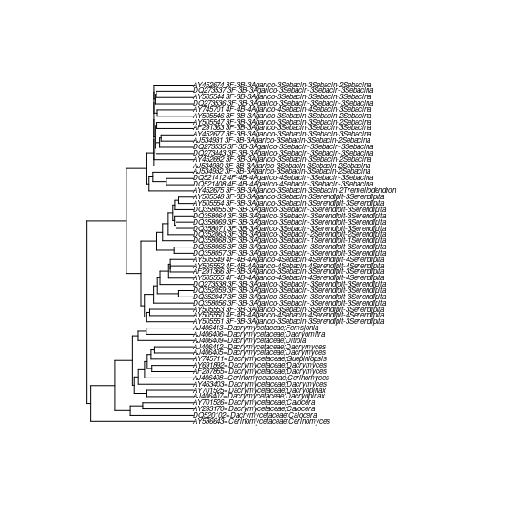
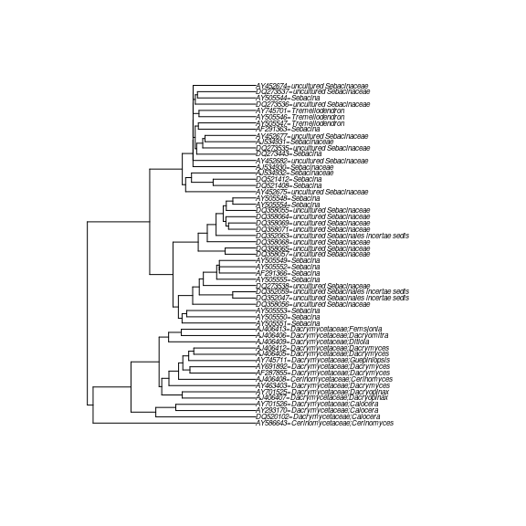

<!-- README.md is generated from README.Rmd. Please edit that file -->

phylotax
========

<!-- badges: start -->

[](https://travis-ci.com/brendanf/phylotax)
[](https://codecov.io/gh/brendanf/phylotax?branch=master)
<!-- badges: end -->

Installation
------------

Install the development version from [GitHub](https://github.com/) with:

``` r
# install.packages("devtools")
devtools::install_github("brendanf/phylotax")
```

Overview
--------

The PHYLOTAX algorithm takes as input taxonomic annotations from one or
more primary taxonomic assignment algorithms, and refines them using a
taxonomic tree. The refinements are of two basic types:

1.  Tips of the tree which are unassigned are assigned to a taxon if the
    tree supports their inclusion in that taxon.
2.  Conflicting assignments between multiple primary algorithms are
    resolved using the tree.

The `phylotax` package also includes the wrapper function `taxonomy()`
which assigns taxonomy to sequences using
[DADA2](https://benjjneb.github.io/dada2/assign.html),
[IDTAXA](http://www2.decipher.codes/Classification.html), or
[SINTAX](https://www.drive5.com/usearch/manual/cmd_sintax.html), along
the `taxtable()` function which converts the results to a uniform
format.

### Example data

Here is an example of a tree:

``` r
library(phylotax)
plot(example_tree(), show.node.label = TRUE)
```


Here is a set of taxonomic assignments for the tips of the tree, based
on two hypothetical primary assignment algorithms “XTAX” and “YTAX”. The
required columns are “label”, “rank”, and “taxon”, which identify
individual OTUs, taxonomic ranks, and taxonomic assignments. The OTU
labels are the same as the tip labels on the tree, in this case the
letters A-F, although some are missing from the taxonomy table because
the algorithms could not place them. Only assignments at the rank of
genus are present in this small example, and the genera in question are
called “Tax1” and “Tax2”. Our example also has a “method” column, which
PHYLOTAX uses to identify which assignments come from the same source.

``` r
example_taxa()
#> # A tibble: 7 x 4
#>   label method rank  taxon
#>   <chr> <chr>  <chr> <chr>
#> 1 B     XTAX   genus Tax1 
#> 2 C     XTAX   genus Tax2 
#> 3 D     XTAX   genus Tax2 
#> 4 B     YTAX   genus Tax2 
#> 5 C     YTAX   genus Tax2 
#> 6 D     YTAX   genus Tax1 
#> 7 F     YTAX   genus Tax1
```

If we sort by the taxon label, we can see that XTAX and YTAX disagree
about the assignment of tips B and D. Neither algorithm has placed tips
A and E, and XTAX also failed to place tip F.

``` r
dplyr::arrange(example_taxa(), label)
#> # A tibble: 7 x 4
#>   label method rank  taxon
#>   <chr> <chr>  <chr> <chr>
#> 1 B     XTAX   genus Tax1 
#> 2 B     YTAX   genus Tax2 
#> 3 C     XTAX   genus Tax2 
#> 4 C     YTAX   genus Tax2 
#> 5 D     XTAX   genus Tax2 
#> 6 D     YTAX   genus Tax1 
#> 7 F     YTAX   genus Tax1
```

### Use PHYLOTAX

Use PHYLOTAX to resolve conflicts and assign additional tips where the
tree supports it.

``` r
phylotax_out <- phylotax(tree = example_tree(), taxa = example_taxa())
#> INFO [2020-10-20 16:04:59] Assigned node 9 (label: 3) and its 2 descendant(s) to genus Tax2.
#> INFO [2020-10-20 16:04:59] Assigned node 10 (label: 4) and its 3 descendant(s) to genus Tax1.
```

PHYLOTAX returns a list of class “`phylotax`” containing the tree, taxa
assignments for tips and internal nodes, as well as tables dividing the
primary assignments into those which were rejected, those which were
retained, and those which were missing from the input tree.

``` r
phylotax_out$assigned
#> # A tibble: 5 x 4
#>   label method   rank  taxon
#>   <chr> <chr>    <ord> <chr>
#> 1 B     PHYLOTAX genus Tax2 
#> 2 C     PHYLOTAX genus Tax2 
#> 3 E     PHYLOTAX genus Tax1 
#> 4 F     PHYLOTAX genus Tax1 
#> 5 D     PHYLOTAX genus Tax1
```

``` r
phylotax_out$retained
#> # A tibble: 5 x 4
#>   label method rank  taxon
#>   <chr> <chr>  <ord> <chr>
#> 1 C     XTAX   genus Tax2 
#> 2 B     YTAX   genus Tax2 
#> 3 C     YTAX   genus Tax2 
#> 4 D     YTAX   genus Tax1 
#> 5 F     YTAX   genus Tax1
```

``` r
phylotax_out$rejected
#> # A tibble: 2 x 4
#>   label method rank  taxon
#>   <chr> <chr>  <ord> <chr>
#> 1 B     XTAX   genus Tax1 
#> 2 D     XTAX   genus Tax2
```

PHYLOTAX has used the following logic:

1.  It’s not possible to decide what the root (node 1) is, because one
    of its direct children (tip A) is completely unassigned.
2.  It’s not possible to decide node 2, because there are differences
    between assignments for two of its descendents (tip C and tip F).
3.  All of the descendents of node 3 (tip B and tip C) have at least one
    assignment of Tax2. PHYLOTAX removes all conflicting assignments
    (XTAX’s assignment of Tax1 to tip B) and gives its own assignment of
    Tax2 to node 3 and all its children.
4.  All of the descendents of node 4 (tips D, E, and F) either have an
    assignment of Tax1 (D and F) or are unassigned (E). Furthermore,
    both branches coming from node 4 (tip D and node 5) do have some
    assignments. PHYLOTAX removes the conflicting assignments (XTAX’s
    assignment of Tax2 to tip D) and gives its own assignment of Tax1 to
    node 4 and all its children.
5.  At node 5, there is nothing to do, because PHYLOTAX already assigned
    it to Tax1 in step 4.

### Continued analysis

If you are continuing on with analysis using the
[phyloseq](https://joey711.github.io/phyloseq/index.html) package, then
you can easily create a `phyloseq` object from a `phylotax` object and
an OTU table.

To demonstrate, we first create a random presence/absence OTU table for
5 samples and the 6 OTUS present in our example dataset. Each species
has a 50% chance to be present in each sample.

``` r
library(phyloseq)
set.seed(1)
otus <- matrix(rbinom(30, 1, 0.5),nrow = 5, dimnames = list(1:5, LETTERS[1:6]))
otus <- otu_table(otus, taxa_are_rows = FALSE)
```

Now we can easily create the phyloseq object.

``` r
physeq <- phylotax_to_phyloseq(phylotax_out, otus)
```

And use it for plots or whatever further analysis is needed.

``` r
plot_tree(physeq, color = "genus")
```



Another example
---------------

Now we’ll try a slightly longer example. Some downloaded reference
sequences in two database formats, as well as “unknowns”, are included
as example data in `phylotax`. This example goes through the process of
aligning, building a tree, performing taxonomic identification by
several algorithms, and then refining the assignments using the tree.

The data in question are LSU rDNA sequences belonging to the fungal
order Sebacinales, taken from the [RDP](https://rdp.cme.msu.edu/) fungal
training set. At the time of the publication of the RDP training set,
much of the order Sebacinales was grouped into a large, polyphyletic
genus, *Sebacina*. Since the work of Oberwinkler et
al.<sup id="a1">[1](#f1)</sup>, the order has been split in two
families, Serendipitaceae and Sebacinaceae, and several additional
genera. For sequences in the database which are annotated as a
particular species, we can look up the current name and classification
for that species. However, for sequences originally annotated as
“*Sebacina* sp.”, “uncultured *Sebacina*”, etc., there is way to decide
what family/genus it should belong in now, except by re-identifying the
sequences.

This is a very small example, with only 15 reference sequences and 39
“unknown” sequences, so it will run quickly. The references are the
sequences from the dataset that were annnotated all the way to genus
level, while the unknowns are the ones that weren’t.

``` r
unknowns <- system.file("extdata/unknowns.fasta.gz", package = "phylotax")
unknowns <- Biostrings::readDNAStringSet(unknowns)
```

Some sequences from Dacrymycetes are also included to use as an outgroup
in the tree.

``` r
outgroup <- system.file("extdata/dacrymycetes.fasta.gz", package = "phylotax")
outgroup <- Biostrings::readDNAStringSet(outgroup)
```

Alignment and phylogeny
-----------------------

We’ll do a quick alignment and phylogeny in R using `DECIPHER`.

``` r
suppressPackageStartupMessages(library(DECIPHER))
aln <- AlignSeqs(c(unknowns, outgroup))
#> Determining distance matrix based on shared 9-mers:
#> ================================================================================
#> 
#> Time difference of 0.04 secs
#> 
#> Clustering into groups by similarity:
#> ================================================================================
#> 
#> Time difference of 0.02 secs
#> 
#> Aligning Sequences:
#> ================================================================================
#> 
#> Time difference of 0.59 secs
#> 
#> Iteration 1 of 2:
#> 
#> Determining distance matrix based on alignment:
#> ================================================================================
#> 
#> Time difference of 0.01 secs
#> 
#> Reclustering into groups by similarity:
#> ================================================================================
#> 
#> Time difference of 0.02 secs
#> 
#> Realigning Sequences:
#> ================================================================================
#> 
#> Time difference of 0.42 secs
#> 
#> Iteration 2 of 2:
#> 
#> Determining distance matrix based on alignment:
#> ================================================================================
#> 
#> Time difference of 0.01 secs
#> 
#> Reclustering into groups by similarity:
#> ================================================================================
#> 
#> Time difference of 0.02 secs
#> 
#> Realigning Sequences:
#> ================================================================================
#> 
#> Time difference of 0.03 secs
#> 
#> Refining the alignment:
#> ================================================================================
#> 
#> Time difference of 0.1 secs
```

Trim the ends where there are a lot of gaps.

``` r
colgaps <- colSums(as.matrix(aln) == "-")
start <- min(which(cummin(colgaps) == 0))
end <- max(which(rev(cummin(rev(colgaps)) == 0)))
aln <- Biostrings::subseq(aln, start = start, end = end)
```

Now we can make a tree.

``` r
distmat <- DistanceMatrix(aln, correction = "Jukes-Cantor")
#> ================================================================================
#> 
#> Time difference of 0 secs
dendro <- IdClusters(distmat, method = "ML", type = "dendrogram", myXStringSet = aln)
#> Constructing initial neighbor-joining tree:
#> ================================================================================
#> 
#> JC69:     -ln(L)=6479, AICc=13297, BIC=13567
#> JC69+G4:  -ln(L)=5960, AICc=12262, BIC=12533
#> K80:      -ln(L)=6234, AICc=12812, BIC=13082
#> K80+G4:   -ln(L)=5731, AICc=11810, BIC=12082
#> F81:      -ln(L)=6491, AICc=13336, BIC=13608
#> F81+G4:   -ln(L)=5979, AICc=12316, BIC=12588
#> HKY85:    -ln(L)=6249, AICc=12856, BIC=13129
#> HKY85+G4: -ln(L)=5741, AICc=11845, BIC=12118
#> T92:      -ln(L)=6235, AICc=12818, BIC=13090
#> T92+G4:   -ln(L)=5732, AICc=11817, BIC=12089
#> TN93:     -ln(L)=6162, AICc=12687, BIC=12960
#> TN93+G4:  -ln(L)=5707, AICc=11782, BIC=12056
#> 
#> The selected model was:  TN93+G4
#> 
#> Maximizing Likelihood of Tree:
#> -ln(Likelihood) = 5707 (0.00% improvement), 0 NNIs -ln(Likelihood) = 5705 (0.03% improvement), 0 NNIs -ln(Likelihood) = 5699 (0.13% improvement), 0 NNIs -ln(Likelihood) = 5693 (0.23% improvement), 0 NNIs -ln(Likelihood) = 5689 (0.32% improvement), 0 NNIs -ln(Likelihood) = 5667 (0.70% improvement), 0 NNIs -ln(Likelihood) = 5661 (0.81% improvement), 0 NNIs -ln(Likelihood) = 5655 (0.90% improvement), 0 NNIs -ln(Likelihood) = 5650 (0.99% improvement), 0 NNIs -ln(Likelihood) = 5648 (1.02% improvement), 0 NNIs -ln(Likelihood) = 5646 (1.06% improvement), 0 NNIs -ln(Likelihood) = 5646 (1.07% improvement), 0 NNIs -ln(Likelihood) = 5645 (1.08% improvement), 1 NNI  -ln(Likelihood) = 5641 (1.16% improvement), 2 NNIs -ln(Likelihood) = 5638 (1.21% improvement), 3 NNIs -ln(Likelihood) = 5637 (1.22% improvement), 4 NNIs -ln(Likelihood) = 5636 (1.23% improvement), 5 NNIs -ln(Likelihood) = 5634 (1.27% improvement), 6 NNIs -ln(Likelihood) = 5634 (1.27% improvement), 7 NNIs -ln(Likelihood) = 5623 (1.47% improvement), 7 NNIs -ln(Likelihood) = 5622 (1.49% improvement), 7 NNIs -ln(Likelihood) = 5621 (1.50% improvement), 7 NNIs -ln(Likelihood) = 5620 (1.51% improvement), 7 NNIs -ln(Likelihood) = 5617 (1.56% improvement), 8 NNIs -ln(Likelihood) = 5617 (1.57% improvement), 9 NNIs -ln(Likelihood) = 5617 (1.57% improvement), 9 NNIs -ln(Likelihood) = 5617 (1.57% improvement), 9 NNIs 
#> 
#> Model parameters:
#> Frequency(A) = 0.256
#> Frequency(C) = 0.196
#> Frequency(G) = 0.302
#> Frequency(T) = 0.247
#> Rate A <-> G = 1.800
#> Rate C <-> T = 5.294
#> Transversion rates = 1
#> Alpha = 0.535
#> 
#> Time difference of 6.55 secs
```

PHYLOTAX needs the tree to be a `phylo` object from the `ape` package.
We can convert from the `dendrogram` in a two-step process.

``` r
library(ape)
#> 
#> Attaching package: 'ape'
#> The following object is masked from 'package:Biostrings':
#> 
#>     complement
tree <- as.phylo(as.hclust(dendro))
```

How does it look?

``` r
plot(tree, cex = 0.5)
```



The tree is already rooted correctly, so we can move on.

Primary taxonomic assignment
----------------------------

DADA2 and SINTAX require the taxonomy to be presented in a different
format in the sequence headers, so the reference file exists in two
versions.

``` r
dada_ref <- system.file("extdata/sebacinales.dada2.fasta.gz", package = "phylotax")
sintax_ref <- system.file("extdata/sebacinales.sintax.fasta.gz", package = "phylotax")
```

Let’s identify the unknown sequences using a few different assignment
algorithms. Different algorithms come from different people, and so they
use different interfaces and give results in different formats. Some are
implemented in R packages, others aren’t. However, the `taxonomy()` and
`taxtable()` functions in `phylotax` simplify this process by making a
single wrapper that calls different external packages.

For starters, we’ll used the RDP naïve Bayesian classifier, which is
also implemented in the `DADA2` R package.

``` r
dada2_result <- taxonomy(unknowns, reference = dada_ref, method = "dada2")
#> Loading required namespace: dada2
#> Finished processing reference fasta.
```

`DADA2` returns taxonomy as a list of matrices.

``` r
str(dada2_result)
#> List of 2
#>  $ tax : chr [1:39, 1:6] "Fungi" "Fungi" "Fungi" "Fungi" ...
#>   ..- attr(*, "dimnames")=List of 2
#>   .. ..$ : Named chr [1:39] "GCGGAGGAAAAGAAACTAACAAGGATTCCCCTAGTAACGGCGAGTGAAGAGGGAATAGCTCAAATTTTGAATCTGGCACCTTTGGTGTCCGAATTGTAATCTAGAGAAGTG"| __truncated__ "AACGGCGAGTGAAGAGGGAAGAGCTCAAATTTTGAATCTGGCGTCTTTGGCGTCCGAATTGTAATCTAGAGAAGTGTTTTCCGTGACGGACCGTGCATAAGTCTCCTGGAA"| __truncated__ "CCCGCTGAACTTAAGCATATCAATAAGCGGAGGAAAAGAAACTAACAAGGATTCCCCTAGTAACGGCGAGTGAAGAGGGAAGAGCTCAAATTTTGAATCTGGCGTCTCTGG"| __truncated__ "GTAACGGCGAGTGAAGAGGGAAGAGCTCAAATTTTGAATCTGGCACCTCTGGTGTCTGAGTTGTAATCTAGAGAAGTGCTTTCTGTGGCGGACCGTGCACAAGTCTCCTGG"| __truncated__ ...
#>   .. .. ..- attr(*, "names")= chr [1:39] "AF291363" "AJ534930" "AJ534931" "AJ534932" ...
#>   .. ..$ : chr [1:6] "Kingdom" "Phylum" "Class" "Order" ...
#>  $ boot: int [1:39, 1:6] 100 100 100 100 100 100 100 100 100 100 ...
#>   ..- attr(*, "dimnames")=List of 2
#>   .. ..$ : Named chr [1:39] "GCGGAGGAAAAGAAACTAACAAGGATTCCCCTAGTAACGGCGAGTGAAGAGGGAATAGCTCAAATTTTGAATCTGGCACCTTTGGTGTCCGAATTGTAATCTAGAGAAGTG"| __truncated__ "AACGGCGAGTGAAGAGGGAAGAGCTCAAATTTTGAATCTGGCGTCTTTGGCGTCCGAATTGTAATCTAGAGAAGTGTTTTCCGTGACGGACCGTGCATAAGTCTCCTGGAA"| __truncated__ "CCCGCTGAACTTAAGCATATCAATAAGCGGAGGAAAAGAAACTAACAAGGATTCCCCTAGTAACGGCGAGTGAAGAGGGAAGAGCTCAAATTTTGAATCTGGCGTCTCTGG"| __truncated__ "GTAACGGCGAGTGAAGAGGGAAGAGCTCAAATTTTGAATCTGGCACCTCTGGTGTCTGAGTTGTAATCTAGAGAAGTGCTTTCTGTGGCGGACCGTGCACAAGTCTCCTGG"| __truncated__ ...
#>   .. .. ..- attr(*, "names")= chr [1:39] "AF291363" "AJ534930" "AJ534931" "AJ534932" ...
#>   .. ..$ : chr [1:6] "Kingdom" "Phylum" "Class" "Order" ...
```

Next, we’ll use another R-friendly taxonomic assignment algorithm,
IDTAXA from the `DECIPHER` package. IDTAXA requires that a model be
trained using the reference database, which can then be used over and
over again to identify different sequences. Although using the functions
provided in `DECIPHER` lets you tweak your training, `phylotax` also has
a wrapper for this, which takes the reference database in the same
format as SINTAX.

``` r
idtaxa_model <- train_idtaxa(sintax_ref)
#> ================================================================================
#> 
#> Time difference of 0.59 secs
```

Now that the model is trained, we can identify the unknown sequences.

``` r
idtaxa_result <- taxonomy(unknowns, reference = idtaxa_model, method = "idtaxa")
#> ================================================================================
#> 
#> Time difference of 0.11 secs
```

IDTAXA gives its result as a list of lists. Here are the first three
elements:

``` r
str(idtaxa_result[1:3])
#> List of 3
#>  $ AF291363:List of 3
#>   ..$ taxon     : chr [1:2] "Root" "unclassified_Root"
#>   ..$ confidence: num [1:2] 45.1 45.1
#>   ..$ rank      : chr [1:2] "rootrank" "kingdom"
#>  $ AJ534930:List of 3
#>   ..$ taxon     : chr [1:7] "Root" "Fungi" "Basidiomycota" "Agaricomycetes" ...
#>   ..$ confidence: num [1:7] 56 56 56 56 56 ...
#>   ..$ rank      : chr [1:7] "rootrank" "kingdom" "phylum" "class" ...
#>  $ AJ534931:List of 3
#>   ..$ taxon     : chr [1:7] "Root" "Fungi" "Basidiomycota" "Agaricomycetes" ...
#>   ..$ confidence: num [1:7] 52.8 52.8 52.8 52.8 52.8 ...
#>   ..$ rank      : chr [1:7] "rootrank" "kingdom" "phylum" "class" ...
#>  - attr(*, "class")= chr [1:2] "Taxa" "Test"
```

Finally, we’ll use SINTAX, an algorithm which is implemented in USEARCH
and its open-source reimplementation, VSEARCH. For this to work, one of
these two must be installed. I’m using VSEARCH; to use USEARCH give
`exec = "usearch"` as an argument.

``` r
sintax_result <- taxonomy(unknowns, reference = sintax_ref, method = "sintax")
```

SINTAX produces output as a delimited file, which `taxonomy()` has
parsed as a `tibble`. However this is still not the format we need for
PHYLOTAX.

``` r
str(sintax_result)
#> tibble [39 × 5] (S3: tbl_df/tbl/data.frame)
#>  $ label : chr [1:39] "AF291363" "AJ534930" "AJ534931" "AJ534932" ...
#>  $ seq   : chr [1:39] "GCGGAGGAAAAGAAACTAACAAGGATTCCCCTAGTAACGGCGAGTGAAGAGGGAATAGCTCAAATTTTGAATCTGGCACCTTTGGTGTCCGAATTGTAATCTAGAGAAGTG"| __truncated__ "AACGGCGAGTGAAGAGGGAAGAGCTCAAATTTTGAATCTGGCGTCTTTGGCGTCCGAATTGTAATCTAGAGAAGTGTTTTCCGTGACGGACCGTGCATAAGTCTCCTGGAA"| __truncated__ "CCCGCTGAACTTAAGCATATCAATAAGCGGAGGAAAAGAAACTAACAAGGATTCCCCTAGTAACGGCGAGTGAAGAGGGAAGAGCTCAAATTTTGAATCTGGCGTCTCTGG"| __truncated__ "GTAACGGCGAGTGAAGAGGGAAGAGCTCAAATTTTGAATCTGGCACCTCTGGTGTCTGAGTTGTAATCTAGAGAAGTGCTTTCTGTGGCGGACCGTGCACAAGTCTCCTGG"| __truncated__ ...
#>  $ hit   : chr [1:39] "k:Fungi(1.00),p:Basidiomycota(1.00),c:Agaricomycetes(1.00),o:Sebacinales(1.00),f:Sebacinaceae(1.00),g:Sebacina(0.98)" "k:Fungi(1.00),p:Basidiomycota(1.00),c:Agaricomycetes(1.00),o:Sebacinales(1.00),f:Sebacinaceae(1.00),g:Sebacina(0.98)" "k:Fungi(1.00),p:Basidiomycota(1.00),c:Agaricomycetes(1.00),o:Sebacinales(1.00),f:Sebacinaceae(1.00),g:Sebacina(0.88)" "k:Fungi(1.00),p:Basidiomycota(1.00),c:Agaricomycetes(1.00),o:Sebacinales(1.00),f:Sebacinaceae(0.97),g:Sebacina(0.95)" ...
#>  $ strand: chr [1:39] "+" "+" "+" "+" ...
#>  $ c12n  : chr [1:39] "k:Fungi,p:Basidiomycota,c:Agaricomycetes,o:Sebacinales,f:Sebacinaceae,g:Sebacina" "k:Fungi,p:Basidiomycota,c:Agaricomycetes,o:Sebacinales,f:Sebacinaceae,g:Sebacina" "k:Fungi,p:Basidiomycota,c:Agaricomycetes,o:Sebacinales,f:Sebacinaceae,g:Sebacina" "k:Fungi,p:Basidiomycota,c:Agaricomycetes,o:Sebacinales,f:Sebacinaceae,g:Sebacina" ...
```

Fortunately, the `taxtable()` function turns any of these three formats
into the format PHYLOTAX needs:

``` r
dada2_taxonomy <- taxtable(dada2_result, min_confidence = 0.6, names = names(unknowns))
idtaxa_taxonomy <- taxtable(idtaxa_result, min_confidence = 0.6)
sintax_taxonomy <- taxtable(sintax_result, min_confidence = 0.6)
```

Now they are all in the same format:

``` r
head(dada2_taxonomy)
#> # A tibble: 6 x 4
#>   label    rank    taxon          confidence
#>   <chr>    <ord>   <chr>               <dbl>
#> 1 AF291363 kingdom Fungi                1   
#> 2 AF291363 phylum  Basidiomycota        1   
#> 3 AF291363 class   Agaricomycetes       1   
#> 4 AF291363 order   Sebacinales          1   
#> 5 AF291363 family  Sebacinaceae         1   
#> 6 AF291363 genus   Sebacina             0.82
head(idtaxa_taxonomy)
#> # A tibble: 6 x 4
#>   label    rank    taxon          confidence
#>   <chr>    <ord>   <chr>               <dbl>
#> 1 DQ521408 kingdom Fungi               0.635
#> 2 DQ521408 phylum  Basidiomycota       0.635
#> 3 DQ521408 class   Agaricomycetes      0.635
#> 4 DQ521408 order   Sebacinales         0.635
#> 5 DQ521408 family  Sebacinaceae        0.635
#> 6 DQ521408 genus   Sebacina            0.635
head(sintax_taxonomy)
#> # A tibble: 6 x 4
#>   label    rank    taxon          confidence
#>   <chr>    <ord>   <chr>               <dbl>
#> 1 AF291363 kingdom Fungi                1   
#> 2 AF291363 phylum  Basidiomycota        1   
#> 3 AF291363 class   Agaricomycetes       1   
#> 4 AF291363 order   Sebacinales          1   
#> 5 AF291363 family  Sebacinaceae         1   
#> 6 AF291363 genus   Sebacina             0.98
```

However, they differ in how many assignments they each made:

``` r
nrow(dada2_taxonomy)
#> [1] 224
nrow(idtaxa_taxonomy)
#> [1] 42
nrow(sintax_taxonomy)
#> [1] 234
```

Keep in mind that assigning one sequence from kingdom to genus is a
total of six assignments.

Now, we can add a “method” column to each of the taxonomy tables and
merge them.

``` r
dada2_taxonomy$method = "DADA2"
idtaxa_taxonomy$method = "IDTAXA"
sintax_taxonomy$method = "SINTAX"
combined_taxonomy = rbind(dada2_taxonomy, idtaxa_taxonomy, sintax_taxonomy)
```

PHYLOTAX
--------

The PHYLOTAX algorithm doesn’t really make sense in an unrooted tree. In
a future version of this README, I’ll include some outgroup sequences.

The `make_taxon_labels()` and `relabel_tree()` functions let us
summarize the state of the assignments before and after PHYLOTAX. The
`abbrev=TRUE` argument makes some abbreviations of common elements of
fungal taxa, to make these easier to read.

``` r
pre_labels <- make_taxon_labels(combined_taxonomy, abbrev = TRUE)
pre_tree <- relabel_tree(tree, pre_labels$old, pre_labels$new)
plot.phylo(pre_tree, cex = 0.5)
```



For each rank, we have a number followed by an abbreviated taxon name.
The number is the number of different algorithms that assigned that
taxon. When there’s a conflict, we see the alternates in angle brackets.
For an example of interpretation, look at Seq4. Out of a total 3
possible, it got:

-   3 assignments for kingdom F(ungi)
-   3 assignments for phylum B(asidiomycota)
-   3 assignments for class Agarico(mycetes)
-   3 assignments for order Sebacin(ales)
-   3 assignments for family Sebacin(aceae)
-   1 assignment each for the genera *Sebacina* and *Tremellodendron*.

Now that we have a tree and a set of primary taxonomic assignments, it’s
time for PHYLOTAX.

``` r
p <- phylotax(tree = tree, taxa = combined_taxonomy)
#> INFO [2020-10-20 16:05:15] Assigned node 58 and its 39 descendant(s) to kingdom Fungi.
#> INFO [2020-10-20 16:05:15] Assigned node 58 and its 39 descendant(s) to phylum Basidiomycota.
#> INFO [2020-10-20 16:05:15] Assigned node 58 and its 39 descendant(s) to class Agaricomycetes.
#> INFO [2020-10-20 16:05:15] Assigned node 58 and its 39 descendant(s) to order Sebacinales.
#> INFO [2020-10-20 16:05:15] Assigned node 62 and its 21 descendant(s) to family Serendipitaceae.
#> INFO [2020-10-20 16:05:15] Assigned node 62 and its 21 descendant(s) to genus Serendipita.
#> INFO [2020-10-20 16:05:15] Assigned node 63 and its 18 descendant(s) to family Sebacinaceae.
#> INFO [2020-10-20 16:05:15] Assigned node 63 and its 18 descendant(s) to genus Sebacina.
```

We can look at the tree again to see how PHYLOTAX has cleaned up the
assignments.

``` r
post_labels <- make_taxon_labels(rbind(p$retained, p$assigned), abbrev = TRUE)
post_tree <- relabel_tree(tree, post_labels$old, post_labels$new)
plot.phylo(post_tree, cex = 0.5)
```



Compare this to the original annotations!

``` r
old_tree <- relabel_tree(tree, names(sebacinales_oldnames), sebacinales_oldnames)
plot(old_tree, cex = 0.5)
```



<a name="f1">1</a> Oberwinkler, F., Riess, K., Bauer, R. et
al. Morphology and molecules: the Sebacinales, a case study. Mycol
Progress 13, 445–470 (2014). <https://doi.org/10.1007/s11557-014-0983-1>
[↩](#a1)
