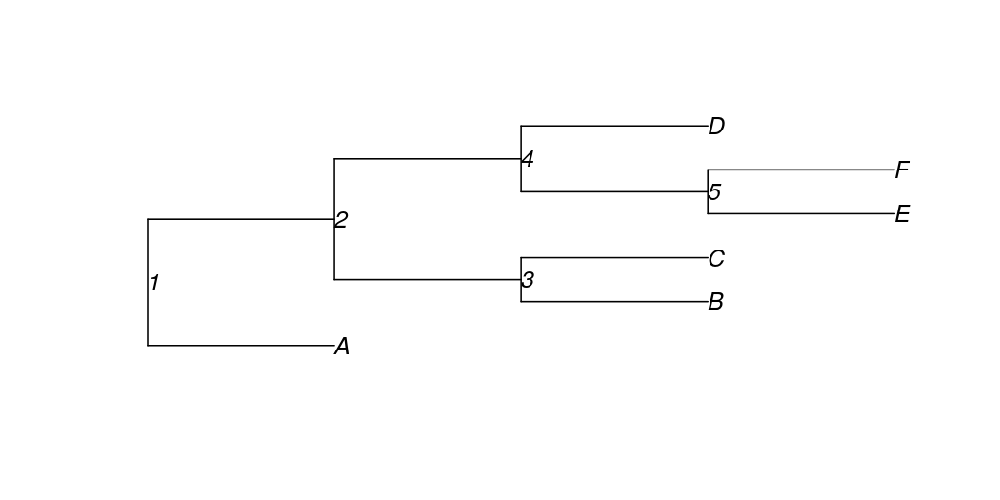

<!-- README.md is generated from README.Rmd. Please edit that file -->

# phylotax

<!-- badges: start -->

[](https://travis-ci.com/brendanf/phylotax)
[](https://codecov.io/gh/brendanf/phylotax?branch=master)
<!-- badges: end -->

## Installation

Install the development version from [GitHub](https://github.com/) with:

``` r
# install.packages("devtools")
devtools::install_github("brendanf/phylotax")
```

## Usage

The PHYLOTAX algorithm takes as input taxonomic annotations from one or
more primary taxonomic assignment algoirthms, and refines them using a
taxonomic tree. The refinements are of two basic types: 1. Tips of the
tree which are unassigned are assigned to a taxon if the tree supports
their inclusion in that taxon. 2. Conflicting assignments between
multiple primary algorithms are resolved using the tree.

Here is an example of a tree:

``` r
library(phylotax)
plot(example_tree(), show.node.label = TRUE)
```



And here is a set of taxonomic assignments for the tips of the tree,
based on two hypothetical primary assignment algorithms “XTAX” and
“YTAX”. Some of the tips have been assigned to two genera: “Tax1”
and “Tax2”. The `phylotax` package includes the function `taxtable()`
which can generate a table of this type based on the output of various
primary assignment algorithms, but all that’s important is that it
contains the columns “label”, “rank”, and “taxon”. The ranks need to be
one of “rootrank”, “domain”, “kingdom”, “phylum”, “class”, “order”,
“family”, “genus”, and “species”. Our example also has a “method”
column, which PHYLOTAX uses to identify which assignments come from the
same source.

``` r
example_taxa()
#> # A tibble: 7 x 4
#>   label method rank  taxon
#>   <chr> <chr>  <chr> <chr>
#> 1 B     XTAX   genus Tax1 
#> 2 C     XTAX   genus Tax2 
#> 3 D     XTAX   genus Tax2 
#> 4 B     YTAX   genus Tax2 
#> 5 C     YTAX   genus Tax2 
#> 6 D     YTAX   genus Tax1 
#> 7 F     YTAX   genus Tax1
```

If we sort by the taxon label, we can see that XTAX and YTAX disagree
about the assignment of tips B and D. Neither algorithm has placed tips
A and E, and XTAX also failed to place tip F.

``` r
dplyr::arrange(example_taxa(), label)
#> # A tibble: 7 x 4
#>   label method rank  taxon
#>   <chr> <chr>  <chr> <chr>
#> 1 B     XTAX   genus Tax1 
#> 2 B     YTAX   genus Tax2 
#> 3 C     XTAX   genus Tax2 
#> 4 C     YTAX   genus Tax2 
#> 5 D     XTAX   genus Tax2 
#> 6 D     YTAX   genus Tax1 
#> 7 F     YTAX   genus Tax1
```

Use PHYLOTAX to resolve conflicts and assign additional tips where the
tree supports it.

``` r
phylotax_out <- phylotax(tree = example_tree(), taxa = example_taxa())
#> INFO [2020-10-14 17:35:34] Assigned node 9 and its 2 children to genus Tax2.
#> INFO [2020-10-14 17:35:34] Assigned node 10 and its 2 children to genus Tax1.
```

PHYLOTAX returns a list containing the tree, taxa assigned to tips, and
taxa assigned to nodes. Let’s look at the tip taxa assignments.

``` r
phylotax_out$tip_taxa
#> # A tibble: 10 x 4
#>    label method   rank  taxon
#>    <chr> <chr>    <ord> <chr>
#>  1 C     XTAX     genus Tax2 
#>  2 B     YTAX     genus Tax2 
#>  3 C     YTAX     genus Tax2 
#>  4 D     YTAX     genus Tax1 
#>  5 F     YTAX     genus Tax1 
#>  6 B     PHYLOTAX genus Tax2 
#>  7 C     PHYLOTAX genus Tax2 
#>  8 E     PHYLOTAX genus Tax1 
#>  9 F     PHYLOTAX genus Tax1 
#> 10 D     PHYLOTAX genus Tax1
```

Phylotax has used the following logic:

1.  It’s not possible to decide what the root (node 1) is, because one
    of its direct children (tip A) is completely unassigned.
2.  It’s not possible to decide node 2, because there are differences
    between assignments for two of its descendents (tip C and tip F).
3.  All of the descendents of node 3 (tip B and tip C) have at least one
    assignment of Tax2. PHYLOTAX removes all conflicting assignments
    (XTAX’s assignment of Tax1 to tip B) and gives its own assignment of
    Tax2 to node 3 and all its children.
4.  All of the descendents of node 4 (tips D, E, and F) either have an
    assignment of Tax1 (D and F) or are unassigned (E). Furthermore,
    both branches coming from node 4 (tip D and node 5) do have some
    assignments. PHYLOTAX removes the conflicting assignments (XTAX’s
    assignment of Tax2 to tip D) and gives its own assignment of Tax1 to
    node 4 and all its children.
5.  At node 5, there is nothing to do, because PHYLOTAX already assigned
    it to Tax1 in step 4.
