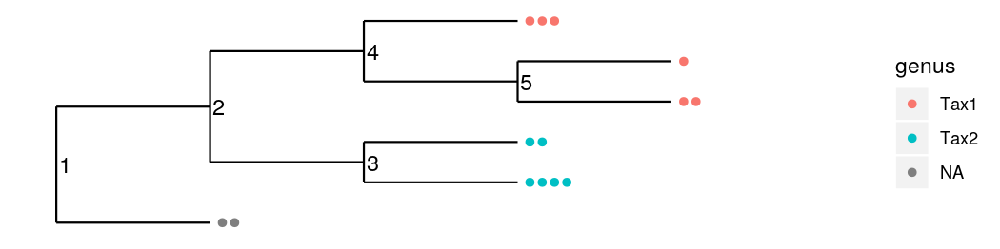

<!-- README.md is generated from README.Rmd. Please edit that file -->

phylotax
========

<!-- badges: start -->

[](https://travis-ci.com/brendanf/phylotax)
[](https://codecov.io/gh/brendanf/phylotax?branch=master)
<!-- badges: end -->

Installation
------------

Install the development version from [GitHub](https://github.com/) with:

``` r
# install.packages("devtools")
devtools::install_github("brendanf/phylotax")
```

Usage
-----

The PHYLOTAX algorithm takes as input taxonomic annotations from one or
more primary taxonomic assignment algorithms, and refines them using a
taxonomic tree. The refinements are of two basic types:

1.  Tips of the tree which are unassigned are assigned to a taxon if the
    tree supports their inclusion in that taxon.
2.  Conflicting assignments between multiple primary algorithms are
    resolved using the tree.

The `phylotax` package also includes the wrapper function `taxonomy()`
which assigns taxonomy to sequences using
[DADA2](https://benjjneb.github.io/dada2/assign.html),
[IDTAXA](http://www2.decipher.codes/Classification.html), or
[SINTAX](https://www.drive5.com/usearch/manual/cmd_sintax.html), along
the `taxtable()` function which converts the results to a uniform
format.

### Example data

Here is an example of a tree:

``` r
library(phylotax)
plot(example_tree(), show.node.label = TRUE)
```


Here is a set of taxonomic assignments for the tips of the tree, based
on two hypothetical primary assignment algorithms “XTAX” and “YTAX”. The
required columns are “label”, “rank”, and “taxon”, which identify
individual OTUs, taxonomic ranks, and taxonomic assignments. The OTU
labels are the same as the tip labels on the tree, in this case the
letters A-F, although some are missing from the taxonomy table because
the algorithms could not place them. Only assignments at the rank of
genus are present in this small example, and the genera in question are
called “Tax1” and “Tax2”. Our example also has a “method” column, which
PHYLOTAX uses to identify which assignments come from the same source.

``` r
example_taxa()
#> # A tibble: 7 x 4
#>   label method rank  taxon
#>   <chr> <chr>  <chr> <chr>
#> 1 B     XTAX   genus Tax1 
#> 2 C     XTAX   genus Tax2 
#> 3 D     XTAX   genus Tax2 
#> 4 B     YTAX   genus Tax2 
#> 5 C     YTAX   genus Tax2 
#> 6 D     YTAX   genus Tax1 
#> 7 F     YTAX   genus Tax1
```

If we sort by the taxon label, we can see that XTAX and YTAX disagree
about the assignment of tips B and D. Neither algorithm has placed tips
A and E, and XTAX also failed to place tip F.

``` r
dplyr::arrange(example_taxa(), label)
#> # A tibble: 7 x 4
#>   label method rank  taxon
#>   <chr> <chr>  <chr> <chr>
#> 1 B     XTAX   genus Tax1 
#> 2 B     YTAX   genus Tax2 
#> 3 C     XTAX   genus Tax2 
#> 4 C     YTAX   genus Tax2 
#> 5 D     XTAX   genus Tax2 
#> 6 D     YTAX   genus Tax1 
#> 7 F     YTAX   genus Tax1
```

### Use PHYLOTAX

Use PHYLOTAX to resolve conflicts and assign additional tips where the
tree supports it.

``` r
phylotax_out <- phylotax(tree = example_tree(), taxa = example_taxa())
#> INFO [2020-10-19 20:29:42] Assigned node 9 (label: 3) and its 2 descendant(s) to genus Tax2.
#> INFO [2020-10-19 20:29:42] Assigned node 10 (label: 4) and its 3 descendant(s) to genus Tax1.
```

PHYLOTAX returns a list of class “`phylotax`” containing the tree, taxa
assignments for tips and internal nodes, as well as tables dividing the
primary assignments into those which were rejected, those which were
retained, and those which were missing from the input tree.

``` r
phylotax_out$assigned
#> # A tibble: 5 x 4
#>   label method   rank  taxon
#>   <chr> <chr>    <ord> <chr>
#> 1 B     PHYLOTAX genus Tax2 
#> 2 C     PHYLOTAX genus Tax2 
#> 3 E     PHYLOTAX genus Tax1 
#> 4 F     PHYLOTAX genus Tax1 
#> 5 D     PHYLOTAX genus Tax1
```

``` r
phylotax_out$retained
#> # A tibble: 5 x 4
#>   label method rank  taxon
#>   <chr> <chr>  <ord> <chr>
#> 1 C     XTAX   genus Tax2 
#> 2 B     YTAX   genus Tax2 
#> 3 C     YTAX   genus Tax2 
#> 4 D     YTAX   genus Tax1 
#> 5 F     YTAX   genus Tax1
```

``` r
phylotax_out$rejected
#> # A tibble: 2 x 4
#>   label method rank  taxon
#>   <chr> <chr>  <ord> <chr>
#> 1 B     XTAX   genus Tax1 
#> 2 D     XTAX   genus Tax2
```

PHYLOTAX has used the following logic:

1.  It’s not possible to decide what the root (node 1) is, because one
    of its direct children (tip A) is completely unassigned.
2.  It’s not possible to decide node 2, because there are differences
    between assignments for two of its descendents (tip C and tip F).
3.  All of the descendents of node 3 (tip B and tip C) have at least one
    assignment of Tax2. PHYLOTAX removes all conflicting assignments
    (XTAX’s assignment of Tax1 to tip B) and gives its own assignment of
    Tax2 to node 3 and all its children.
4.  All of the descendents of node 4 (tips D, E, and F) either have an
    assignment of Tax1 (D and F) or are unassigned (E). Furthermore,
    both branches coming from node 4 (tip D and node 5) do have some
    assignments. PHYLOTAX removes the conflicting assignments (XTAX’s
    assignment of Tax2 to tip D) and gives its own assignment of Tax1 to
    node 4 and all its children.
5.  At node 5, there is nothing to do, because PHYLOTAX already assigned
    it to Tax1 in step 4.

### Continued analysis

If you are continuing on with analysis using the
[phyloseq](https://joey711.github.io/phyloseq/index.html) package, then
you can easily create a `phyloseq` object from a `phylotax` object and
an OTU table.

To demonstrate, we first create a random presence/absence OTU table for
5 samples and the 6 OTUS present in our example dataset. Each species
has a 50% chance to be present in each sample.

``` r
library(phyloseq)
set.seed(1)
otus <- matrix(rbinom(30, 1, 0.5),nrow = 5, dimnames = list(1:5, LETTERS[1:6]))
otus <- otu_table(otus, taxa_are_rows = FALSE)
```

Now we can easily create the phyloseq object.

``` r
physeq <- phylotax_to_phyloseq(phylotax_out, otus)
```

And use it for plots or whatever further analysis is needed.

``` r
plot_tree(physeq, color = "genus")
```


